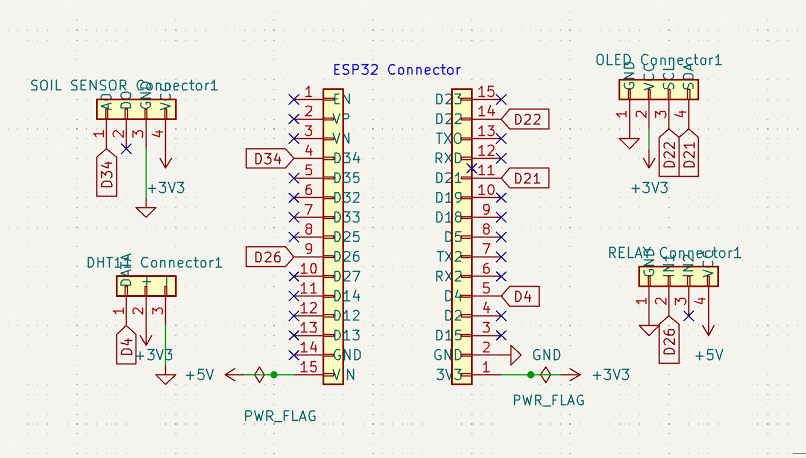
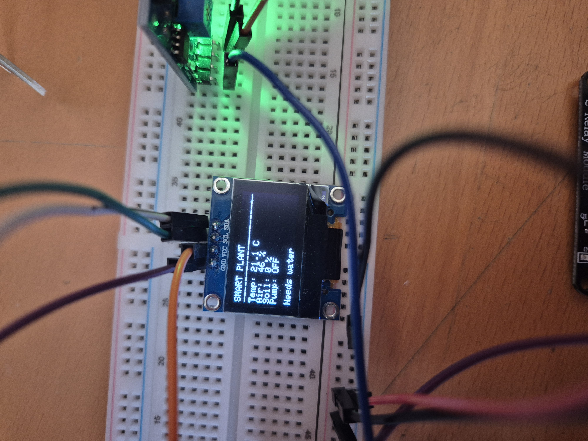

# 🌱 ESP32 Smart Plant Monitoring System

An IoT project that monitors plant conditions and automatically controls watering using an ESP32 microcontroller.

## 📋 Features

- 🌡 Temperature and humidity monitoring (DHT11)
- 🌱 Soil moisture monitoring
- 💧 Automatic watering using a relay and water pump
- 📺 OLED display
- 🌐 Wi-Fi web interface
- 🔌 Custom PCB designed in KiCad

---

## 🛠 Hardware

- ESP32 DevKit V1
- DHT11 Sensor
- Soil Moisture Sensor
- SSD1306 OLED Display
- Relay Module
- Custom-built DC Water Pump

---

## 💻 Software

- Arduino IDE
- KiCad 10

---

## 📁 Repository Structure

- `firmware/` → ESP32 firmware
- `pcb/` → KiCad project files
- `gerber/` → PCB manufacturing files
- `images/` → Project images

---

## 📷 Schematic

---

## 🖥️ PCB Layout

---

## 📦 3D PCB View

---

## 🌐 Web Dashboard

---

## 🔧 Working Prototype

The system was first developed and tested on a breadboard before designing the custom PCB.

### 📺 OLED Display

Real-time sensor readings and watering status are displayed locally on the OLED screen.

## 🚀 Current Status

- ✅ Prototype completed
- ✅ Firmware completed
- ✅ Custom PCB designed
- ✅ Gerber files generated
- ⏳ Physical PCB assembly coming soon

---

## 👨‍💻 Author

**Antreas Petrou**

Electrical Engineering Student  
Aristotle University of Thessaloniki

---

## 📄 License

This project is licensed under the MIT License.
